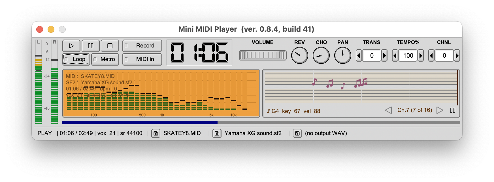
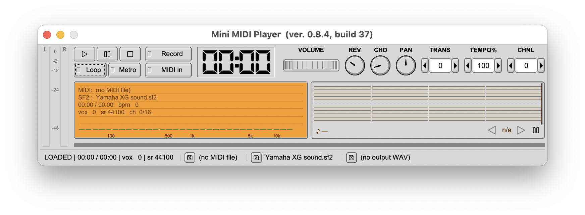
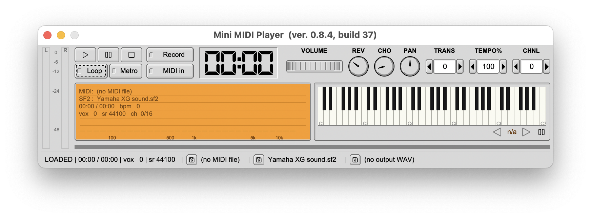

# Mini MIDI Player

[](https://www.paypal.com/donate?business=6QXS8MBPKBTTN&item_name=Mini+MIDI+Player&currency_code=USD)

A compact, fully-static SoundFont MIDI player for macOS, Linux, and Windows
with a developer-friendly CLI and a focus on professional audio-meter
visuals — VU meter, FFT spectrum, piano-roll, scrolling note glyphs, and
a live piano keyboard.

<p align="center">
  
  <br/>
  <em>Playing — VU meter, FFT spectrum, scrolling note glyphs.</em>
</p>

<p align="center">
  
  &nbsp;
  
  <br/>
  <em>Idle state (left) and the piano-keyboard visualizer (right).</em>
</p>

## What it does

Mini MIDI Player loads a Standard MIDI File (`.mid`) plus a SoundFont
(`.sf2` / `.sf3`) and plays it through your default audio device.
Underneath, it's a tiny self-contained engine — **TinySoundFont** for
synthesis, **TinyMidiLoader** for SMF parsing, **KissFFT** for spectrum
analysis, **libogg + libvorbis** for SF3 sample decoding — all linked
statically so the binary has no third-party dylib dependencies.

Beyond playback, the GUI exposes a developer-grade toolbox:

- **Live audio meters** — stereo VU meter and an amber-LCD FFT spectrum.
- **Four switchable visualizers** sharing a channel selector — scrolling
  piano-roll, music-glyph notation (♩ ♪ ♫ ♬), live piano keyboard, or
  full-width spectrum-only.
- **Channel filter + global solo** — pause animations, step through the
  channels actually firing, or solo a single MIDI channel at the engine
  level via the `CHNL` counter.
- **SoundFont inspector** — full preset table by bank / program / name.
- **MIDI inspector** — per-track event counts, channel maps, tempo /
  time / key signature changes.
- **SF2 ↔ SF3 converter** — round-trip with per-sample Vorbis encode /
  decode.
- **Output recording** to a WAV file alongside live playback.
- **Persisted state** — the last SoundFont auto-restores at launch;
  shift-click any file label to revisit recent items.

A `mmp` CLI is embedded inside the macOS app bundle for headless
rendering, dumping, and probing.

## Install

Download the latest signed and notarized DMG from
[Releases](https://github.com/ppiecuch/mini-midi-player/releases),
drag **MiniMidiPlayer.app** into `/Applications`, and launch it.
Gatekeeper opens it with no warnings.

The CLI lives at
`MiniMidiPlayer.app/Contents/MacOS/mmp` — symlink it into your `PATH`
if you want shell access:

```bash
ln -s /Applications/MiniMidiPlayer.app/Contents/MacOS/mmp /usr/local/bin/mmp
mmp --help
```

## Build from source

Requirements: macOS 13+, Xcode command-line tools, CMake 3.20+, Python 3
(for the one-time fontaudio extraction during `deps/update.sh`), and a
prebuilt static FLTK 1.4 (libraries + headers).

Point CMake at your FLTK install with `-DFLTK_DIR=/path/to/fltk` (or the
`FLTK_DIR` env var). The directory must contain `lib/libfltk.a`,
`lib/libfltk_images.a`, `lib/libfltk_png.a`, `lib/libfltk_jpeg.a`,
`lib/libfltk_z.a`, and `include/FL/`.

First-time setup pulls the vendored deps (TinySoundFont, TinyMidiLoader,
KissFFT, fontaudio, OpenSymbol):

```bash
./deps/update.sh
```

Then:

```bash
cmake -B build -DFLTK_DIR=/path/to/fltk
cmake --build build -j8
# → build/MiniMidiPlayer.app
# → build/mmp                  (also embedded inside the .app)
```

`./_scripts/build.sh` wraps the above and bumps the build number with
`+`:

```bash
./_scripts/build.sh        # build only
./_scripts/build.sh +      # bump build number, then build
```

### Distributable build (Developer ID + notarization)

One-time setup of an Apple notary keychain profile:

```bash
xcrun notarytool store-credentials minimidiplayer-notary \
    --apple-id YOU@example.com \
    --team-id YOUR_TEAM_ID \
    --password APP_SPECIFIC_PASSWORD
```

Then:

```bash
./_scripts/archive.sh                        # signed .app only
./_scripts/archive.sh + --notarize           # bump build, archive, notarize
./_scripts/archive.sh + --notarize --dmg     # also produce a notarized .dmg
```

`archive.sh` enforces the static-linking invariant — it runs `otool -L`
against both binaries and fails the archive if anything outside the
system-library prefixes shows up. Outputs land in `dist/`.

## CLI

```
mmp play   <file.mid> -sf <file.sf2>
mmp render <file.mid> -sf <file.sf2> -o out.wav [-r 44100]
mmp dump   <file.sf2> [--json]
mmp probe
mmp -h | --version
```

## Links

- Repository: <https://github.com/ppiecuch/mini-midi-player>
- Report an issue: <https://github.com/ppiecuch/mini-midi-player/issues>

## License

Copyright © 2026 KomSoft Oprogramowanie. All rights reserved.

Bundled open-source components: FLTK (LGPL 2.1 + static-linking exception),
TinySoundFont (MIT), TinyMidiLoader (MIT), KissFFT (BSD-3),
fontaudio (MIT), OpenSymbol (GPL-2.0 / LGPL-2.1+).

## Support

If you find this useful, please consider supporting development:

[](https://www.paypal.com/donate?business=6QXS8MBPKBTTN&item_name=Mini+MIDI+Player&currency_code=USD)
